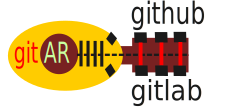

# Introduction

Git all remotes (gitar) is a command line tool that brings common development
operations such as opening a pull request down to the shell. It works with
multiple domains such as Github and Gitlab. It can be seen as an alternative to
 both Github <https://github.com/cli/cli> and Gitlab
<https://gitlab.com/gitlab-org/cli> cli tools. The scope is smaller as the main
focus is not to implement all the workflows but the ones a software engineer
might use more often, such as opening merge requests or quickly gathering
information about important processes like the status of a pipeline or releases.

Gitar implements the REST API for Gitlab and Github following best practices,
such as respecting rate limits and pagination. It also implements local caching
to minimize interacting with the REST API and it uses conditional HTTP requests
when the local cache is considered expired.

The tool is written in Rust and it is available for Linux, MacOS.

## Sections

**[Getting Started](./getting_started.md)**

Get started by installing the binary and creating a configuration file.

**[Gitar commands](./cmds/index.md)**

List of commands available in Gitar.
