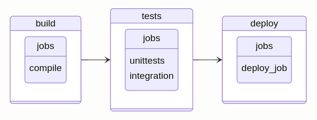

# gr pp

`gr pp` is a command that allows you to handle pipelines from the command line.

<!-- toc -->

## List pipelines

To list pipelines for the current project, you can use the following command:

```bash
gr pp list
```

## Lint pipeline configuration (`.gitlab-ci.yml`)

To lint the pipeline configuration file (`.gitlab-ci.yml`), you can use the following command:

```bash
gr pp lint
```

## Get runners available for the project (Gitlab)

To get the runners available for the project, you can use the following command:

```bash
gr pp rn list <status>
```

Where `<status>` can be one of the following values:

- `online`
- `offline`
- `stale`
- `never-contacted`
- `all`

## Get the merged .gitlab-ci.yml

In the scenario where you use a Gitlab pipeline declared in `.gitlab-ci.yml` and
the pipeline contains `include` statements, you can use the following command to
obtain the total configuration of the pipeline:

```bash
gr pp merged-ci
```

This will print out to the console the total merged `.gitlab-ci.yml` file that
includes all the contents from the included yaml files. If the pipeline has
errors it will print out the errors if any.

## Mermaid diagram of .gitlab-ci.yml

This command is intended to provide a quick and general idea about the project's
pipeline structure by computing a state Mermaid diagram off of the
`.gitlab-ci.yml` contents. The implementation is not exhaustive and does not
cover all the possible cases that can govern a pipeline creation. It just
computes the stages involved, its jobs and the links in between them.  The
command does not compute whether a stage belongs to a specific branch or to a merge
request event.

```bash
gr pp chart
```

For example, given the following `.gitlab-ci.yml`:

```yaml
stages:
  - build
  - tests
  - deploy

compile:
  stage: build
  script:
    - echo "build the project"

unittests:
  stage: tests
  script:
    - echo "Run unit tests"

integration:
  stage: tests
  script:
    - echo "Run integration tests"

deploy_job:
  stage: deploy
  script:
    - echo "Deploying the project..."
```

The corresponding Mermaid diagram that would get generated would look like this:

```verbatim
stateDiagram-v2
    direction LR
    state build{
        direction LR
        state "jobs" as anchorT0
        state "compile" as anchorT0
    }
    build --> tests
    state tests{
        direction LR
        state "jobs" as anchorT1
        state "unittests" as anchorT1
        state "integration" as anchorT1
    }
    tests --> deploy
    state deploy{
        direction LR
        state "jobs" as anchorT2
        state "deploy_job" as anchorT2
    }
```

If you copy the above diagram and paste it in a markdown file or in the mermaid
live editor <https://mermaid.live>, you will get the following diagram:


